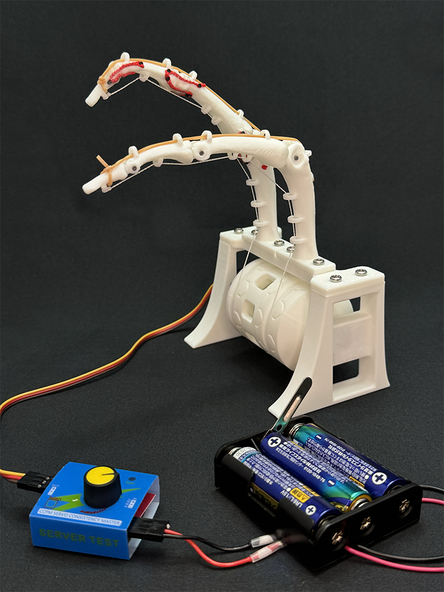

# 人体模倣中指ロボット（Anthropomimetic Middle Finger Robot）

📘 日本語版（このページ）  
🌍 [English](README_EN.md)

---
## 概要



本リポジトリでは、**人体の中指の構造を模倣したロボット指**の  オープンハードウェア設計データを公開しています。

本プロジェクトは、  
- 人体模倣ロボット関節機構と従来ロボット関節機構の比較  
- 人体構造（骨・関節）の理解  
- 教育・体験用途  
を目的として設計されています。

本ロボットは **マイコンやソフトウェアを使用せず**、  
サーボモータ・サーボテスター・電池のみで動作します。  
そのため、ものづくりをしたことがない中学生・高校生でも扱いやすい構成になっています。
「部品を用意するのが大変だ」、「作り方を直接教えてほしい」、「お金がない」という場合には、電気通信大学で開催されている[匠ガールプロジェクトのラボ体験](http://www.ge.uec.ac.jp)や[脳・医工学研究センターのスプリングセミナー](http://blsc.xsrv.jp/)で本ロボットキットの作成体験会を実施していますので、ご参加ください。

東郷研究室では、この人体模倣中指ロボットの作り方を拡張・発展させ、様々な身体部位の人体模倣ロボットの開発に取り組んでいます。本ロボットの作成を面白いと感じたら、是非東郷研究室に参加してください。

---

## 特徴

- 人体（生物）関節を模したモデルと、回転（ロボット）関節モデルの2種類を用意
- ヒトの末節骨〜中手骨までの構造を再現
- 3Dプリント可能なSTLデータと編集可能なCADデータ（STEP）を提供
- 教育用途を想定したシンプルな構成
- ソフトウェア不要（完全ハードウェア）

---

## リポジトリ構成

```
cad/        CADデータ（STEP、F3D）
stl/        3Dプリント用STLデータ
docs/       組み立てマニュアル
licenses/   ライセンス関連ファイル
```

---

## 必要部品（BOM）

必要な部品の一覧は以下を参照してください。

- [部品表（BOM）](./BOM.md)

※ 教育用途を想定しており、同等品・代替品の使用は問題ありません。

---
## 部品の準備

### 樹脂部品の3Dプリント

Bambu Lab A1 miniでの造形を確認しています。
造形パラメータは以下のとおりです。

| フィラメント | Bambu Lab PLA Basic |
| ------ | ------------------- |
| 積層ピッチ  | 0.2 mm              |
| 充填率    | 15 %                |
| インフィル  | グリッド                |
| ノズル    | 0.4 mm              |

### 靭帯の準備

鎖編みを解説する[YouTube動画](https://youtu.be/j-NHvQiJupI?si=Ml5NFn5y3y6gGRWc)などを参考に、PEワイヤを鎖編みします。
[1 mm用のレース針](https://amzn.asia/d/457qnYa)で編んでいます。
端点は結ぶか、ライターで炙って処理します。

---
## 組み立て方法

組み立て手順の詳細は、以下のマニュアルを参照してください。

- 日本語マニュアル：`docs/manual_ja.pdf`

※ 本マニュアルは体験会で配布しているマニュアルを一部改変したものです。本OSH版ではベース（右）の研究室・大学ロゴを削除しています。

---
  
## ライセンス

本リポジトリには、複数のライセンスが適用されています。  
使用する際は、対象ファイルのライセンスを必ず確認してください。

- **骨（人体）モデル**  
  - `/cad/finger_*`,  `/stl/finger_*`  
  - Creative Commons Attribution-ShareAlike 2.1 Japan (CC BY-SA 2.1 JP)  
  - 元データ：[BodyParts3D / ライフサイエンス統合データベースセンター](https://lifesciencedb.jp/bp3d/)

- **土台・プーリー等のオリジナル設計部品**  
  - `/cad/base_*`,  `/stl/base_*`  
  - Creative Commons Attribution 4.0 International (CC BY 4.0)

- **組み立てマニュアル（PDF）**  
  - © Togo Laboratory, All Rights Reserved

詳細は `LICENSE` および `licenses/` フォルダ内のファイルを参照してください。

※ 本リポジトリに含まれる研究室ロゴ・大学ロゴ・名称等は、上記ライセンスの対象外です。これらの使用には、別途許可が必要です。

---

## 注意事項・免責

- 本データは教育・研究用途を目的として提供されています。
- 本ロボットの使用・改造・配布は自己責任で行ってください。
- 可動部による指の挟み込み等に注意してください。
- 本リポジトリの内容を利用したことによるいかなる損害についても、作者は責任を負いません。

---

## 作者・連絡先

東郷 俊太  
電気通信大学大学院情報理工学研究科  
機械知能システム学専攻　准教授  
[ResearchMap](https://researchmap.jp/shuntatogo)
[東郷研究室](http://www.hi.mce.uec.ac.jp/togolab/)
[X](https://twitter.com/togo_lab/)
[Instagram](https://www.instagram.com/togolab_uec/)
[YouTube](https://www.youtube.com/channel/UC10spcvW8-pCTLKy5rrDHyw)

ご質問や不具合報告は GitHub Issues あるいはs.togo[at]uec.ac.jpまで。

東郷研究室では、教育・研究活動へのご支援も歓迎しています。
[電気通信大学基金](https://www.uec.ac.jp/kikin/archives/fund/togolab)

---

## 関連発表

 * 深代 悠太，姜 銀来，横井 浩史，東郷 俊太，“人体模倣母指CM関節の可動域と関節剛性の計測”，第43回日本ロボット学会学術講演会，2D2-01，東京科学大学大岡山キャンパス，2025年9月2–5日．
 * 永嶋 圭佑，姜 銀来，横井 浩史，東郷 俊太，”人体模倣中指ロボットのSim2Realに向けたシミュレーターと実機の開発”，ロボティクス・メカトロニクス講演会2025，2A1-J05，山形ビッグウイング，2025年6月4日–7日．
 * 工藤 陸，姜 銀来，横井 浩史，東郷 俊太，“人体を模倣した流体潤滑を有する指関節構造の粘弾性特性”，第42回日本ロボット学会学術講演会，2J3-06，大阪工業大学梅田キャンパス，2024年9月3–6日．
 * 小畑 承経，姜 銀来，横井 浩史，東郷 俊太，“人体の筋骨格構造を模倣したロボット手指・手首および前腕の開発”，ロボティクス・メカトロニクス講演会2024，2A2-J06，ライトキューブ宇都宮，2024年5月29日–6月1日．
 * 工藤 陸，姜 銀来，横井 浩史，東郷 俊太，“人体を模倣した流体潤滑を有する指関節構造の粘性特性”，ロボティクス・メカトロニクス講演会2024，1A1-D06，ライトキューブ宇都宮，2024年5月29日–6月1日．
 * 小畑 承経，姜 銀来，横井 浩史，東郷 俊太，“人体の筋骨格構造を模倣したロボット手首および前腕の開発” ，第41回日本ロボット学会学術講演会，1B3-02，仙台国際センター，2023年9月11–14日．
 * 工藤 陸，姜 銀来，横井 浩史，東郷 俊太，“人体の関節における液体潤滑を模倣した指関節構造の開発” ，第41回日本ロボット学会学術講演会，1B3-01，仙台国際センター，2023年9月11–14日．
